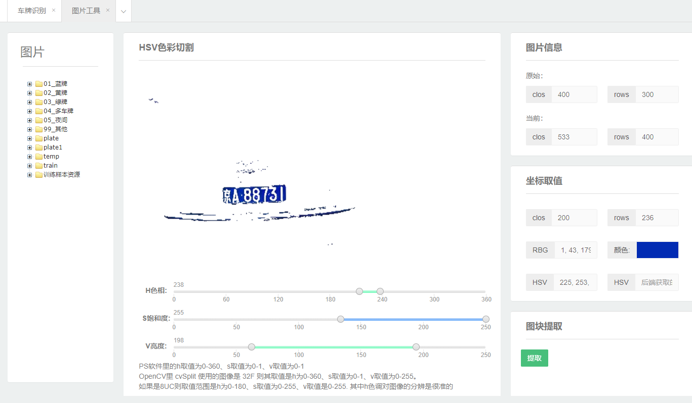

# yx-image-recognition

#### 写在前面的话
- 这是一个基于spring boot + maven + opencv 实现的**Demo教程项目**
- **贯穿样本处理、模型训练、图像处理、对象检测、对象识别等技术点**
- 以学习交流为目的，代码注释超多，文档也在逐步完善
- java语言的深度学习项目，在整个开源社区来说都相对较少；拥有完整的训练、检测、识别过程的开源项目更是少之又少！！
- 本人目前也正在学习图片识别相关技术，**代码及文档持续更新中，大牛请绕路**

#### 包含功能
- **蓝、绿、黄车牌检测及车牌号码识别**
- **网上常见的轮廓提取车牌算法JAVA实现**
- **hsv色彩分割提取车牌算法JAVA实现**
- **harrcascade特征识别算法 JAVA实现**
- **基于svm算法的车牌检测训练JAVA实现**
- **基于ann算法的车牌号码识别训练JAVA实现**
- **人脸检测**  接下来将实现人脸识别
- 图片工具: 目前实现了**HSV色彩切割**，后续将添加更多使用的图片处理工具，用于辅助算法优化
- **证件文字识别**

#### 相关文档
- **[00_相关问题解答.md](./doc/00_相关问题解答.md)**
主要关于识别失败、识别错误、如何优化算法的相关问题解答
- **[01_开发环境搭建.md](./doc/01_开发环境搭建.md)**
- [02_SVM训练说明文档.md -待补齐](./doc/02_SVM训练说明文档.md)
- [03_ANN训练说明文档.md -待补齐](./doc/03_ANN训练说明文档.md)
- **[04_车牌识别过程说明文档.md](./doc/04_车牌识别过程说明文档.md)**
- **[05_部分图像处理算法说明文档.md](./doc/05_车牌识别部分算法说明文档.md)**
- [06_人脸识别过程说明文档.md -待补齐](./doc/06_人脸识别过程说明文档.md)

#### 操作界面

#### 软件版本
- jdk 1.8.61+
- maven 3.0+
- opencv 4.0.1 [或者：javacpp1.4.4、opencv-platform 4.0.1-1.4.4]
- tess4j 4.3.1
- spring boot 2.1.5.RELEASE
- yx-image-recognition 1.0.0版本

#### 软件架构
- B/S 架构，前端html + requireJS，后端java
- 数据库使用 sqlite3.0
- 接口文档使用swagger 2.0

#### 使用说明

- **相关图片来源于网络，仅用于交流学习，不得用于商业用途；如有侵权，请联系本人删除**
- 转发请注明出处； 本项目作者：yuxue，一个不资深的java语言从业者
- 作者gitee地址: https://gitee.com/admin_yu
- 作者csdn微博地址：https://blog.csdn.net/weixin_42686388

#### 参考文档
- 本人参考了EasyPR C++项目、以及fan-wenjie的EasyPR-Java项目；同时查阅了部分opencv官方4.0.1版本C++的源码，结合个人对java语言的理解，整理出当前项目
- liuruoze/EasyPR：https://gitee.com/easypr/EasyPR?_from=gitee_search
- fan-wenjie/EasyPR-Java： https://github.com/fan-wenjie/EasyPR-Java
- opencv官方： https://opencv.org/

